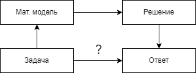

# 1. Введение в математические модели

## Про задачи

-   Одной задаче могут соответствовать разные модели;

-   Разные модели дают разные решения;

-   Основной критерий выбора модели - практика.

Основа теории вероятностей - азартные игры (в процессе игры поднимаются
ставки).

## Парадокс при игре в кости

Правильная игральная кость при бросании с равными шансами падает на
любую из граней 1, 2, 3, 4, 5, 6.

В случае бросания двух костей сумма выпавших чисел заключена между 2 и 12. 
Как 9, так и 10 из чисел 1, 2, \..., 6 можно получить двумя разными
способами: 9=3+6 или 9=4+5 и 10=4+6 или 10=5+5. Почему 9 появляется
чаще, когда бросают две кости, чем 10?

::: details `sol` Решение
9: 3+6, 6+3, 4+5, 5+4 = 4 из 36 случаев, а 10: 4+6, 6+4,
5+5 = 3 из 36 случаев.

Получается, что 9 выпадает чаще, чем 10, ч.т.д.
:::

## Парадокс раздела ставки

Два игрока играют в безобидную игру (то есть шансы на выигрыш одинаковы)
и они договорились, что тот, кто первым выиграет 6 партий, получит весь
приз. Предположим, что на самом деле игра остановилась, до того, как
один из них выиграл приз (например, первый игрок выиграл 5 партий,
второй - 3). Как справедливо следует разделить приз?

::: details `sol` Решение
 Мысленно представим, что матч бы продолжился. Всего
возможно четыре исхода:

-   А - 1-ый игрок выигрывает первую партию;

-   Б - 1-ый игрок выигрывает вторую партию, проиграв первую;

-   В - 1-ый выигрывает третью, проиграв первую и вторую;

-   Г - 1-ый проигрывает все партии.

Вероятность (*по теореме о независимых событиях*) событий А, Б, В, Г
соответственно 0.5, 0.25, 0.125, 0.125 (в сумме 1).

(\*) Вероятность победы 1-го, в таком случае, 0.875, второго - 0.125, то
есть в 7 раз меньше. Делим приз на 8 частей - 7 первому, 1 второму.

Ответ: 7:1
:::