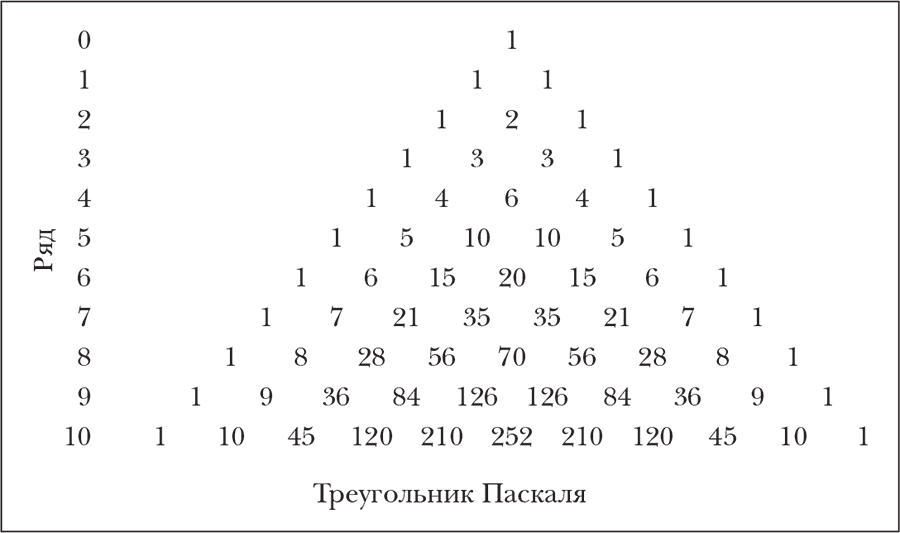
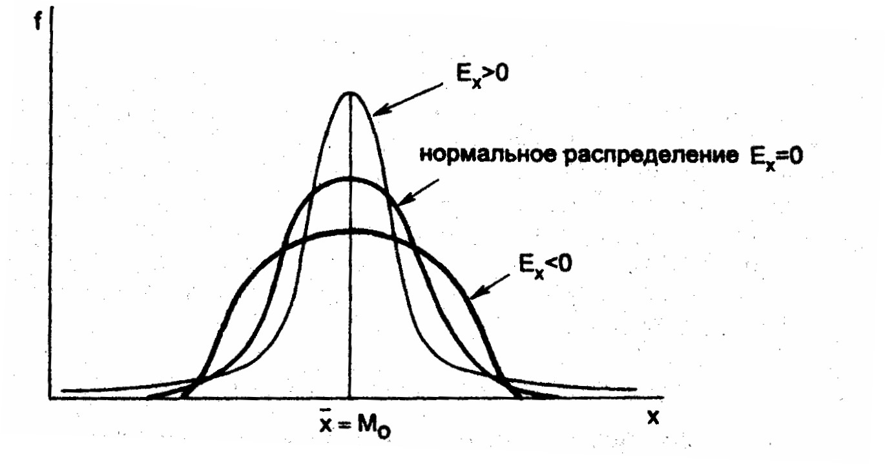
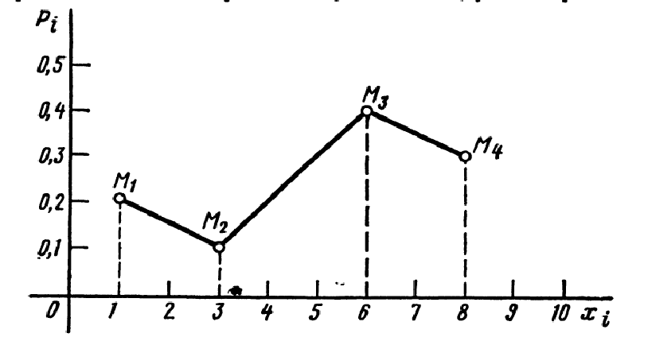

# 12. Моменты случайных величин

## Начальный момент

$a_k = \mathbb{M}[\xi^k]$ - k-ый начальный момент.

::: tip `tip` Мое замечание 
Не существует понятие "первый начальный момент". При k = 1 величина называется "математическое ожидание".
:::

## Центральный момент

$m_k = \mathbb{M}[(\xi - \mathbb{M}_\xi)^k]$ - k-ый центральный момент.
::: tip `rmk` Замечание преподавателя
$m_1=0$ всегда.

$m_2$ называется "дисперсией".
:::

## Зависимость центральных и начальных моментов

$m_3 = \mathbb{M}[(\xi - \mathbb{M}_\xi)^3] = \mathbb{M}[\xi^3 - 3\xi^2\mathbb{M}_\xi + 3\xi(\mathbb{M}_\xi)^2 - (\mathbb{M}_\xi)^3] =$ $\mathbb{M}[\xi^3] - 3\mathbb{M}[\xi^2]\mathbb{M}_\xi+3(\mathbb{M}_\xi)^3 - (\mathbb{M})^ 3 = a_3 - 3a_2a_1 + 2(a_1)^3$

::: tip `tip` Мое замечание 
Эти формулы позволяют получить упрощение вычислений. Числа возле начальных моментов можно получить из треугольника Паскаля (см. ниже), где ряд - порядок центрального момента.
:::

## Абсолютные моменты
### Абсолютный начальный момент

$\mathbb{M}[|\xi|^k]$ - k-ый абсолютный начальный момент = начальный момент модуля.

### Абсолютный центральный момент

$\mathbb{M}[|\xi - \mathbb{M}_\xi|^k]$ - k-ый абсолютный центральный момент.

## Медиана

Характеристика, важная для дискретных случайных величин.

::: info `def` Медиана
Такое число l, что $\mathbb{P}(\xi < l) = \mathbb{P}(\xi \geq l)$.

При этом $\mathbb{F}_\xi(l)=\dfrac{1}{2}$
:::

::: tip `tip` Мое замечание 
Квантиль — граница деления выборки или совокупности на равные по размеру смежные подгруппы.
:::

$x_p$ (квантиль порядка $p$) \Rightarrow $\mathbb{P}(\xi < x_p) = p \leftrightarrow \mathbb{F}_\xi(x_p) = p,\ 0<p<1$.

$\mathbb{P}(\xi < x_p) = p$. При $p = \dfrac{1}{2}\ l \ -$ медиана.

## Мода

::: tip `tip` Мое замечание 
Мода — это точка, в которой плотность (для непрерывных случайных величин) или вероятность (для дискретных случайных величин) достигает своего максимума.
:::

Для дискретной случайной величины $x_{i-1}<x_i=m<x_{i+1},$ если $\mathbb{P}_i \geq \mathbb{P}_{i-1}$ и $\mathbb{P}_i \geq \mathbb{P}_{i+1}$, то есть такое значение, что вероятность в этой точке/точках не меньше вероятности в соседних точках.

Для непрерывной случайной величины мода - точка локального максимума плотности.

::: danger `imp` Распределения
- 1 точка моды - **унимодальное** распределение;
- 2 точки моды - **бимодальное** распределение;
- 3+ точки моды - **полимодальное** распределение.
:::

## Только у непрерывных случайных величин

### Коэффициент асимметрии

::: tip `tip` Мое замечание 
Коэффициент асимметрии описывает, насколько распределение случайной величины $\xi$ асимметрично относительно своего среднего значения (или центра). Он показывает, есть ли "перекос" влево или вправо.
:::

::: info `def` Коэффициент асимметрии
$\beta = \dfrac{M[(\xi−\mu)^3]}{\sigma^3}$, где числитель - третий центральный момент, а знаменатель - среднее квадратическое отклонение в кубе.
:::

1.  $\beta = 0 \Rightarrow$ распределение симметрично (например, нормальное распределение).
2. $\beta > 0 \Rightarrow$ положительная асимметрия (правый хвост длиннее или тяжелее).
3. $\beta < 0 \Rightarrow$ отрицательная асимметрия (левый хвост длиннее или тяжелее).

### Коэффициент эксцесса

::: tip `tip` Мое замечание 
Коэффициент эксцесса описывает "остроту" пика распределения и "тяжесть" его хвостов по сравнению с нормальным распределением. Он показывает, насколько распределение "вытянуто" или "сплющено".
:::

::: info `def` Коэффициент эксцесса
$\gamma = \dfrac{M[(ξ−μ)^3]}{σ^3} - 3$, где числитель - третий центральный момент, а знаменатель - среднее квадратическое отклонение в кубе, а вычитание 3 делается, чтобы сравнивать с нормальным распределением, у которого $\beta = 0$.
:::

::: warning `clm` Утверждение
В симметричном унимодулярном распределении (например, нормальном) мода, медиана и матожидание совпадают.

В асимметричном распределении они расходятся. Например, при положительной асимметрии: мода < медиана < матожидание.
:::

## Только у дискретных случайных величин

### Многоугольник распределения

::: info `def` Многоугольник распределения
Ломаная линия, отрезки которой последовательно соединяют точки с координатами ($x_i, \mathbb{P}_i$), где $x_i$ — возможные значения случайной величины, а $\mathbb{P}_i$ — соответствующие вероятности.
:::

Он строится в прямоугольной системе координат, в которой по оси абсцисс отсчитываются значения случайной величины, а по оси ординат — их вероятности.