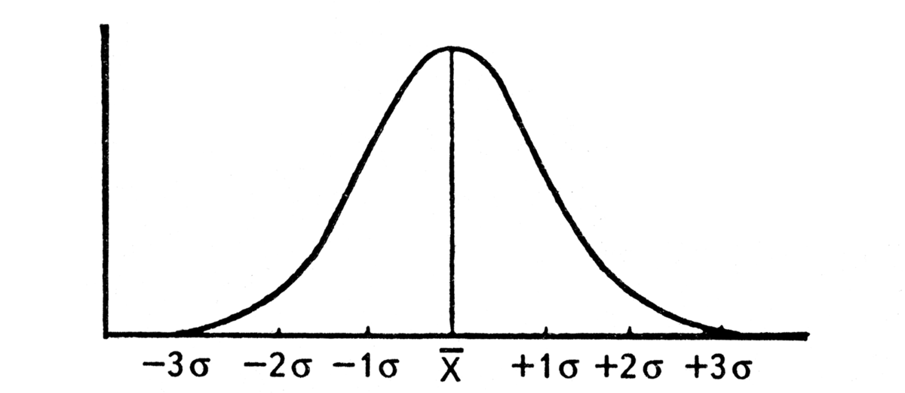

# 13. Нормальный закон, нормальное распределение и его свойства

## Определение нормального распределения

::: info `def` Нормальное (Гауссовское) распределение
Говорят, что случайная величина распределена по нормальному закону, если $$\rho(x) = \dfrac{1}{\sqrt{2\pi}\sigma}exp({-\dfrac{(x-a)^2}{2\sigma^2}}),$$ где a -математическое ожидание, $\sigma$ - среднее квадратическое отклонение.
При этом $-\infty<x<+\infty, \ -\infty < a < +\infty$.
:::

::: tip `rmk` Замечание преподавателя 
Вероятность того, что случайная величина лежит в пределах $3\sigma=0.99$. Событие выхода за пределы практически невозможно 
:::

::: warning `fct` Факт 
Пусть $\xi$ и $\eta$ связаны линейным образом: 
$$\eta = \sigma(>0)\cdot\xi + a$$
Тогда функция распределения $\mathbb{F}_\eta=\mathbb{P}(\eta < x)=\mathbb{P}(\sigma\xi + a < x) = \mathbb{P}(\xi < \dfrac{x-a}{\sigma})=\mathbb{F}_\xi(\dfrac{x-a}{\sigma})$. То есть, зная функцию распределения $\mathbb{F}_\xi$, можем найти $\mathbb{F}_\eta$.
:::

::: warning `fct` Факт 
Пусть $\xi$ и $\eta$ связаны линейным образом: 
$$\eta = \sigma(>0)\cdot\xi + a$$
Тогда плотность распределения $\rho_\eta=\dfrac{1}{\sigma}\mathbb{F}'_\xi(\dfrac{x-a}{\sigma})$.
:::

## Стандартное нормальное распределение

::: tip `rmk` Замечание преподавателя 
Чтобы упростить решение задачи, сначала находим стандартное нормальное распределение, а оттуда любой.
:::

::: info `def` Стандартное нормальное распределение
Случайная величина $\xi$ распределена по стандартизированному нормальному закону, если $a=0, \ \sigma=1$.

$\rho_\xi(x)=\dfrac{1}{\sqrt{2\pi}}exp({\dfrac{-x^2}{2}})$

$\mathbb{F}_\xi(x)=\dfrac{1}{\sqrt{2\pi}}\overset{x}{\underset{-\infty}{\int}}exp(-\dfrac{\tau^2}{2})d\tau$
:::

::: warning `cor` Плотность и функция распределения
Пусть $\xi$ и $\eta$ связаны линейным образом: 
$\eta = \sigma(>0)\cdot\xi + a$, тогда:

$\rho_\xi(x)=\dfrac{1}{\sqrt{2\pi}\sigma}exp({\dfrac{-(x-a)^2}{2\sigma^2}})$

$\mathbb{F}_\xi(x)=\dfrac{1}{\sqrt{2\pi}}\overset{\frac{x-a}{\sigma}}{\underset{-\infty}{\int}}exp(-\dfrac{\tau^2}{2})d\tau = \mathbb{F}_\xi(\dfrac{x-a}{\sigma})$
:::

## Интеграл Лапласа

$$\Phi(x) = \dfrac{1}{\sqrt{2\pi}} \overset{x}{\underset{0}{\int}} exp(\dfrac{-x^2}{2})dx.$$

Иногда:

$$\Phi(x) = \dfrac{1}{\sqrt{2\pi}} \overset{x}{\underset{-\infty}{\int}} exp(\dfrac{-x^2}{2})dx$$

### Свойства интеграла Лапласа
::: danger `imp exm` Пример
1. $\Phi(-x)=-\Phi(x)$
2. $\Phi(\infty) = \frac{1}{2}$
3. 
    1) $x \geq 0 \Rightarrow \mathbb{F}_\eta(x) = \frac{1}{2} + \Phi(x)$
    2) $x < 0 \Rightarrow \mathbb{F}_\eta(x) = \frac{1}{2} - \Phi(x)$

4. $\mathbb{M}_\xi = \dfrac{1}{\sqrt{2\pi}}\overset{+\infty}{\underset{-\infty}{\int}}x \cdot exp(\frac{-x^2}{2}) dx = \dfrac{1}{\sqrt{2\pi}}exp(\dfrac{-x^2}{2})\overset{+\infty}{\underset{-\infty}{|}} = 0$
5. $\mathbb{D}_\xi = 1\ -$ совпадает со вторым начальным моментом.
:::

$\mathbb{M}_\eta = \mathbb{M}(\sigma \xi + a) = a$

Параметр a при определении нормального закона - математическое ожидание.

::: tip `rmk` Замечание преподавателя 
Вспомним свойство математического ожидания унимодального распределения - совпадение среднего, медианы и моды.
:::