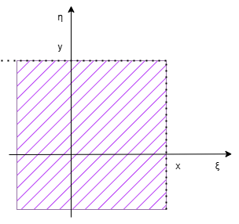
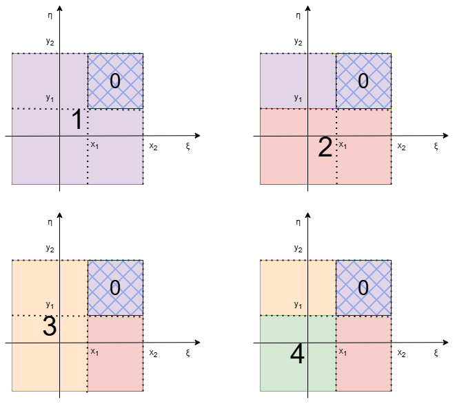

# 15. Многомерные случайные величины

## Определение

Пусть задано вероятностное пространство $(\Omega, \mathfrak{A}, \mathbb{P})$ и упорядоченный набор случайных величин, заданных на этом пространстве. Он называется **n-мерной случайной величиной** или **n-мерным случайным вектором**.

::: info `def` n-мерный случайный вектор
Упорядоченный набор случайных величин, заданных на вероятностном пространстве.
:::

::: info `def` Компонента
Одномерная случайная величина, составляющая случайный вектор.
:::

::: info `def` Двумерный случайный вектор
Упорядоченная пара случайных величин.
:::

Если каждая компонента случайного вектора дискретная, то многомерная случайная величина тоже дискретная.

Если каждая компонента случайного вектора непрерывная, то многомерная случайная величина тоже непрерывная.

## Характеристики

### Функция распределения
Функция распределения случайной величины $\mathbb{F}_{\xi, \eta}(x, y) = \mathbb{P}(\xi < x, \eta < y)$ попадает в область:

Свойства функции распределения:

1. $0 \leq \mathbb{F}_{\xi, \eta}(x, y) \leq 1$;
2. Неубывающая по каждой компоненте;
3. Если хотя бы одна компонента стремится к $-\infty$, то вся функция распределения $\mathbb{F}_{\xi, \eta}(x, y) = 0$, потому что исключена возможность, что случайная величина меньше, чем $-\infty$;
4. Если все компоненты стремятся к $+\infty$, то $\mathbb{F}_{\xi, \eta}(x, y) = 1$;
5. Если одна компонента стремится к $+\infty$, то функция распределения двумерного случайного вектора $\mathbb{F}_{\xi, \eta}(x, y)$ становится маргинальной по не бесконечной компоненте;

Выше представлена схема, на которой введены следующие обозначения:

0 - прямоугольник $(x_1 \leq \xi < x_2, \ y_1 \leq \eta < y_2)$

1 - прямоугольник $(\xi < x_2, \ \eta < y_2)$

2 - прямоугольник $(\xi < x_2, \ \eta < y_1)$

3 - прямоугольник $(\xi < x_1, \ \eta < y_2)$

4 - прямоугольник $R = (\xi < x_1, \ \eta < y_1)$

6. Вероятность попадания в прямоугольник $R = (x_1 \leq \xi < x_2, \ y_1 \leq \eta < y_2)$ вычисляется как:
    $$\mathbb{P}({\xi,\eta} \in R) = \mathbb{F}(x_2,y_2) + \mathbb{F}(x_1,y_1) - \mathbb{F}(x_2,y_1) - \mathbb{F}(x_1,y_2).$$

### Закон распределения

Рассмотрим дискретные случайные величины $\xi = \{x_1, \dotsc, x_n \}, \ \eta = \{y_1, \dotsc, y_n \}$. Многомерная случайная величина - все пары ($x_i, y_j$). При этом $P_{ij} = \mathbb{P}(\xi = x_i, \eta = y_j).$

| $\eta / \xi$ | $x_1$ | $x_2$ | ... | $x_n$ | 
| :------| :------: | :----: | :----: | :------:
| $y_1$ | $P_{11}$ | $P_{12}$ | ... | $P_{1n}$ |
| $y_2$ | $P_{21}$ | $P_{22}$ | ... | $P_{2n}$ |
| ... | ... | ... | ... | ... |
| $y_n$ | $P_{n1}$ | $P_{n2}$ | ... | $P_{nn}$ |

Эта матрица называется **законом распределения** многомерной случайной величины. Зная эту матрицу, можно находить законы распределения компонент.

::: warning `fct` Факт
$$\underset{i,j}{\sum}P_{ij} = 1.$$
:::

### Плотность распределения

::: info `def` Плотность распределения многомерной случайной величины
Вторая производная функции распределения по x и по y.

$$\rho(x,y) = \dfrac{d^2 \mathbb{F}(x,y)}{dx\ dy}$$
:::

Свойства плотности распределения:

1. Неотрицательность: $\rho(x,y) > 0 $;
2. $\overset{+\infty}{\underset{-\infty}{\int}}\rho(x,y)dxdy = 1$
3. $\mathbb{F}(x,y) = \overset{x}{\underset{-\infty}{\int}}\overset{y}{\underset{-\infty}{\int}}\rho(x,y)dxdy \ -$ интеграл по прямоугольнику;
4. 
    1) $\rho(x) = \overset{+\infty}{\underset{-\infty}{\int}}\rho(x,y)dy$
    2) $\rho(y) = \overset{+\infty}{\underset{-\infty}{\int}}\rho(x,y)dx$

## Проверка независимости компонент двумерного случайного вектора

Для независимости компонент двумерного случайного вектора для всех значений должно выполняться следующее равенство:

$$ P_{ij} = P_{i \bullet} \cdot P_{\bullet j},$$

где $P_{ij} \ -$ вероятность $\mathbb{P}(\xi = x_i,\ \eta=y_j)$, $P_{i\bullet} \ -$ вероятность $\mathbb{P}(\xi = x_i \ \forall y_j)$, $P_{\bullet j} \ -$ вероятность $\mathbb{P}(\eta=y_j \ \forall x_i).$ Удобнее всего выполнять проверку на клетках с нулями.

::: details `exm` Пример
Игральная кость бросается дважды. Построим закон распределения двумерного случайного вектора $(\xi,\eta)$, где $\xi \ -$ количество выпадений шести очков, а $\eta \ -$ количество выпадений нечетной цифры (1, 3, 5).

| $\eta \ \xi$ | 0 | 1 | 2 | $P(\eta = y)$ | 
| :---: | :---: | :---: | :---: | :---: |
| 0 | $\dfrac{4}{36}$ | $\dfrac{4}{36}$ | $\dfrac{1}{36}$ | $\dfrac{9}{36}$ |
| 1 | $\dfrac{12}{36}$ | $\dfrac{6}{36}$ | 0 | $\dfrac{18}{36}$ |
| 2 | $\dfrac{9}{36}$ | 0 | 0 | $\dfrac{9}{36}$ |
| $P(\xi = x)$ | $\dfrac{25}{36}$ | $\dfrac{10}{36}$ | $\dfrac{1}{36}$ | 1 |

Проведем проверку на независимость: $\dfrac{4}{36} \neq \dfrac{9}{36} \cdot \dfrac{25}{36} \Rightarrow$ зависимы.
:::