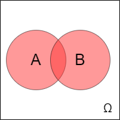
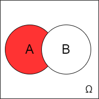

# 2. Случайные события

## Понятие случайного события

::: info `def`  Событие
Предметом исследования в теории вероятностей являются **события**,
появляющиеся при определенных условиях, которые можно воспроизводить
неограниченное количество раз. 
:::

::: info `def`  Эксперимент
Комплекс этих условий называется **эксперимент** (испытание, опыт).
:::

## Классификация событий

-   **Невозможное событие** - то, которое не может произойти в рамках
    испытания.

-   **Достоверное событие** - то, которое точно произойдет в рамках
    испытания.

-   **Случайное событие** - то, которое может произойти или не произойти в
    рамках эксперимента:

    -   **Совместные события** - те, которые в рамках эксперимента могут
        произойти одновременно.

    -   **Несовместные события** - те, которые не могут произойти
        одновременно в рамках одного эксперимента (появление одного из
        них исключает появление второго)

    -   **Равновозможные события** - те, которые в рамках эксперимента
        происходят с одинаковой частотой.

    -   **Противоположные события** - непоявление одного из них в рамках
        эксперимента влечет появление другого.

## Операции над событиями

1.  $A=B$: (равенство) - если появление A влечет за собой появление B, а
    B - влечет A (не обязательно совпадают).

2.  $A+B\ (A \bigcup B)$: сумма (объединение) - появление хотя бы одного
    из событий.

    
    

3.  $A \cdot B\ (A \bigcap B)$: произведение (пересечение) -
    осуществление обоих событий.

    

4.  $A \setminus B$: разность - происходит A, но не происходит B.

    
## Классическая формула вероятности

::: danger `imp` Классическая формула вероятности
$$P(A) = \dfrac{M}{N},$$
где N - число всех исходов испытания, а M -
число исходов, благоприятствующих событию A.
:::

### Общая схема решения задач {#общая-схема-решения-задач .unnumbered}

1.  Определить, в чем состоит случайный эксперимент и какие у него
    элементарные события (исходы). Убедиться, что они равновозможны;

2.  Найти общее число элементарных исходов N;

3.  Определить, какие элементарные исходы благоприятствуют интересующему
    нас событию А, и найти их число M;

4.  Найти вероятность события А по формуле $P(A) = \dfrac{M}{N}$.

## Геометрическая вероятность

::: warning `fct` Факт
Если А имеет нулевую площадь, то вероятность попадания в А равна *нулю*.
:::

Можно определить геометрическую вероятность в пространстве и на прямой:
$$P(A) = \dfrac{V(A)}{V(\Omega)}, P(A) = \dfrac{L(A)}{L(\Omega)}.$$
